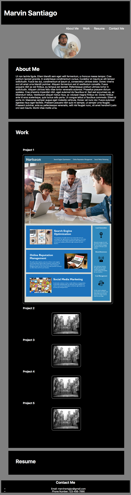

# PortfolioMS

## Description

* We were supposed to create a portfolio showing our projects. For this we need to include our name, image. Clicking on the navigation will take you to sections pertaining to them for example, About me will take you to about me. When you click on the first project image, it will take you to the website pertaining to it. The first project image is bigger than the others. I have a responsive layout. 

## Screenshot of the website

Repo Link:

https://github.com/MaSaLo13/PortfolioMS

Deployed Site:

https://masalo13.github.io/PortfolioMS/